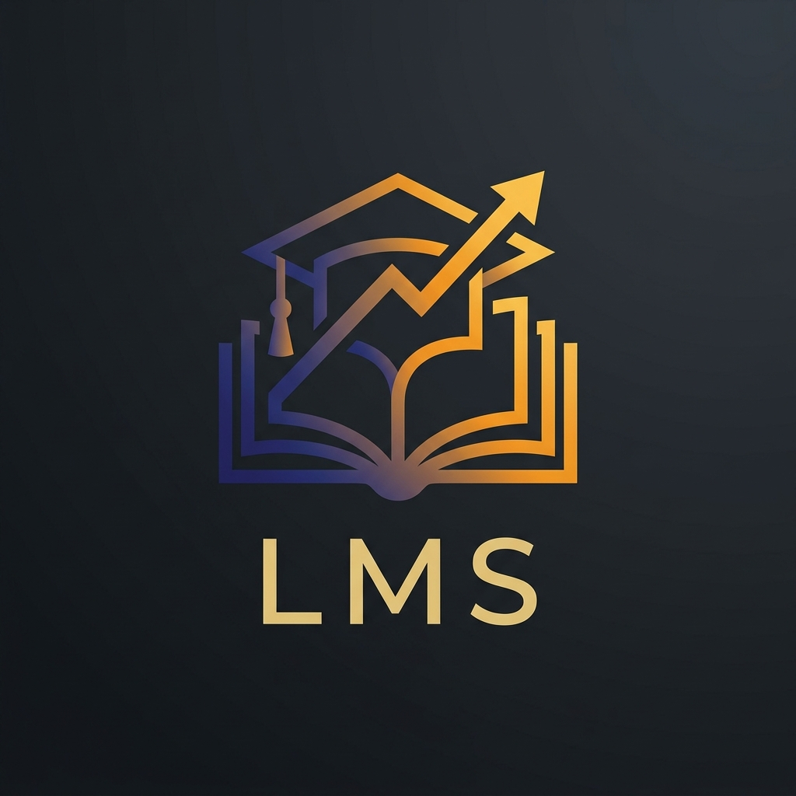

# 🎓 LMS Premium - Plateforme d'Apprentissage Moderne



Une plateforme de gestion de l'apprentissage (LMS) moderne, performante et élégante, conçue avec une interface **Premium Navy & Gold**. Ce projet offre une expérience utilisateur fluide pour les étudiants, les enseignants et les administrateurs.

---

## ✨ Points Forts du Projet

- **Design Premium** : Interface basée sur le concept de *glassmorphism* avec une palette de couleurs raffinée **Navy & Gold** (Marine et Or) pour un rendu professionnel et haut de gamme.
- **Tableaux de Bord Intuitifs** : Vues spécialisées pour chaque rôle utilisateur (Admin, Professeur, Étudiant).
- **Gestion de Contenu Complète** : Création de cours, chapitres, ressources multimédias et quiz.
- **Sécurité Robuste** : Authentification via JWT, hachage de mots de passe avec bcrypt et validation de données avec Joi.

---

## 🛠️ Stack Technique

### Frontend
- **Framework** : React 18 + Vite
- **Navigation** : React Router DOM 6
- **Style** : CSS Moderne + Bootstrap 5 (Custom Design)
- **Icônes** : Lucide React

### Backend
- **Serveur** : Node.js + Express
- **Base de données** : MySQL
- **Authentification** : JSON Web Token (JWT) + Cookies
- **Gestion de fichiers** : Multer

---

## 🚀 Fonctionnalités par Rôle

### 👨‍🎓 Étudiant
- **Dashboard Personnel** : Suivi de la progression globale et accès rapide aux cours.
- **Vue des Cours** : Consultation des chapitres et téléchargement de ressources.
- **Système de Quiz** : Passage de quiz avec **tentative unique** forcée et affichage immédiat des résultats.
- **Historique des Notes** : Visualisation de toutes les notes obtenues dans l'onglet Profil.

### 👨‍🏫 Enseignant
- **Gestionnaire de Cours** : Création, modification et suppression de cours et chapitres.
- **Gestion des Ressources** : Upload de documents (PDF, Doc, etc.) pour chaque chapitre.
- **Suivi des Étudiants** : Visualisation de la progression des étudiants inscrits à leurs cours.

### 🛡️ Administrateur
- **Contrôle Total** : Gestion des utilisateurs, des cours et des annonces globales.
- **Interface de Pilotage** : Vue d'ensemble des statistiques de la plateforme.

---

## 📦 Installation et Configuration

### 1. Prérequis
- Node.js (v18 ou supérieur)
- MySQL (v8 ou supérieur)

### 2. Base de Données
Initialisez la base de données en utilisant le script fourni :
```bash
mysql -u root -p < db/init_db.sql
```

### 3. Backend
```bash
cd backend
npm install
# Créez votre fichier .env et remplissez les informations de connexion DB
node app.js
```

### 4. Frontend
```bash
cd frontend
npm install
npm run dev
```

---

## 🔐 Comptes de Test

| Rôle | Email | Mot de passe |
| :--- | :--- | :--- |
| **Administrateur** | `admin@lms.com` | `admin123` |
| **Enseignant** | `fatima@lms.com` | `teacher123` |
| **Étudiant** | `ikram@lms.com` | `student123` |

---

## 📂 Structure du Projet

```bash
PROJET-LMS/
├── backend/            # API Express & Logique métier
│   ├── routes/         # Endpoints de l'API
│   ├── middleware/     # Auth & Vérification de rôles
│   └── app.js          # Point d'entrée serveur
├── frontend/           # Application React
│   ├── src/
│   │   ├── components/ # Composants UI Premium
│   │   ├── pages/      # Vues principales (Dashboards, Login, etc.)
│   │   └── assets/     # Styles CSS & Images
├── db/                 # Scripts SQL d'initialisation
└── docs/               # Documentation utilisateur & technique
```

---

> [!TIP]
> Pour une expérience optimale, assurez-vous que les ports 5000 (Backend) et 3000 (Frontend) sont libres sur votre machine.