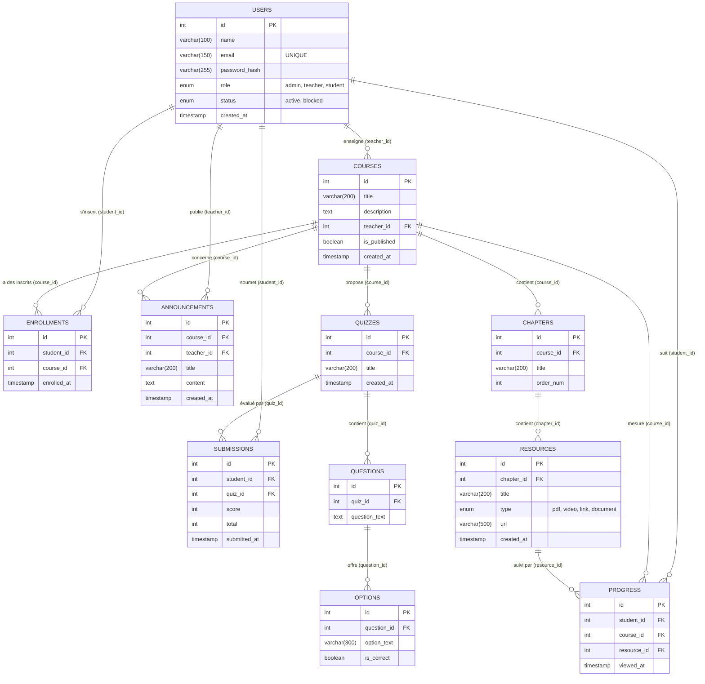
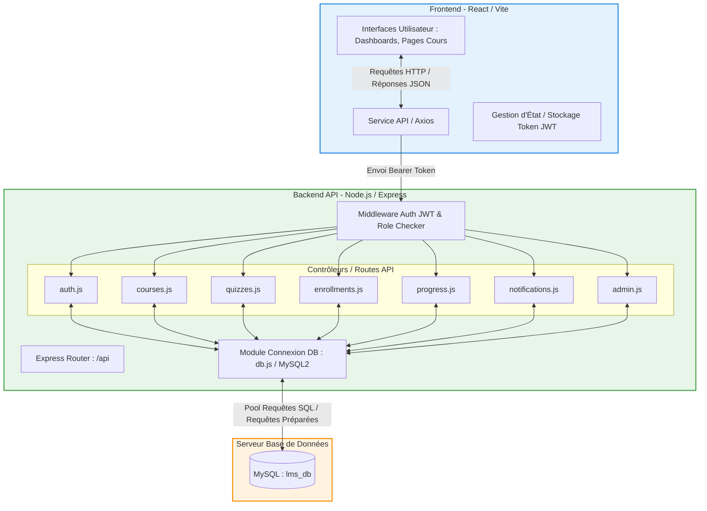
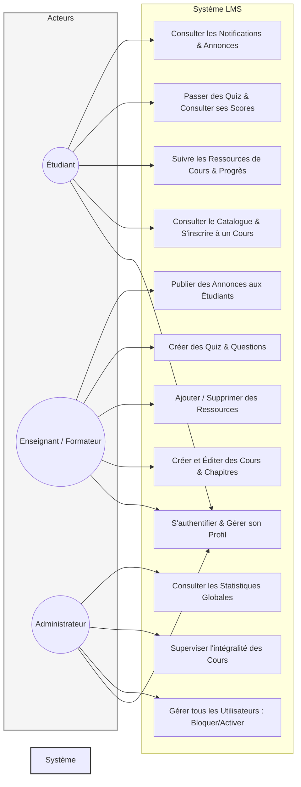
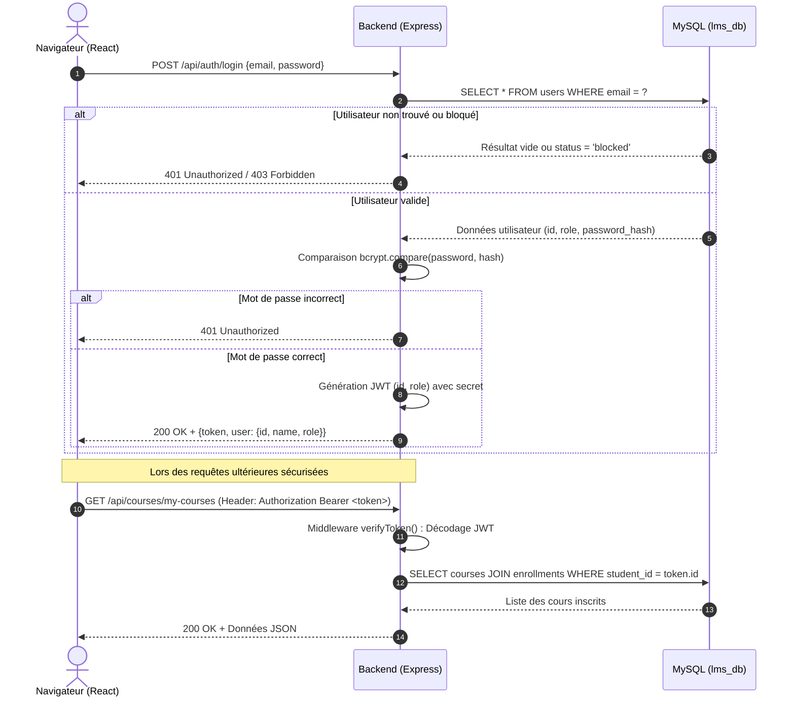
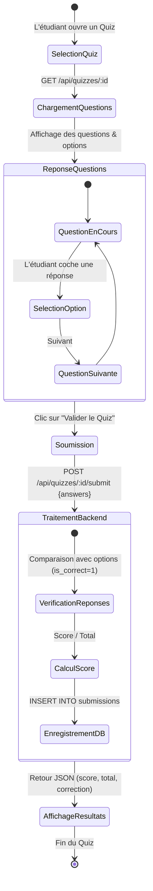

# Architecture & Diagrammes UML du Projet LMS

Ce document rassemble les spécifications techniques et les diagrammes UML exacts du projet **LMS (Learning Management System)**. Ces schémas reflètent rigoureusement la structure de la base de données MySQL, l'architecture du backend (Express/Node.js) et du frontend (React/Vite).

---

## 1. Diagramme Entité-Relation (Modèle de Données / Diagramme de Classes)

Ce diagramme modélise l'intégralité des tables MySQL (`lms_db`), leurs clés primaires (PK), clés étrangères (FK), types de champs exacts et les relations (1:N, N:M) entre les entités.



---

## 2. Diagramme d'Architecture du Système (Composants & Flux)

Présentation des flux de communication entre le client (Navigateur / React), l'API Backend Express.js (et ses routeurs/middlewares) et la base de données MySQL.



---

## 3. Diagramme de Cas d'Utilisation (Use Cases des Acteurs)

Les trois rôles distincts de la plateforme (`student`, `teacher`, `admin`) et leurs interactions avec le système.



---

## 4. Diagramme de Séquence : Authentification & Token JWT

Processus d'identification d'un utilisateur et d'accès sécurisé aux routes protégées par jeton d'authentification (JSON Web Token).



---

## 5. Diagramme d'Activité : Déroulement d'un Quiz & Enregistrement du Score

Logique fonctionnelle d'un étudiant répondant à un quiz et du calcul / stockage de son évaluation dans le système.



---

## 6. Diagramme de Composants (Component Diagram)

Ce diagramme illustre l'organisation modulaire du système en composants logiciels, mettant en évidence les interfaces requises et fournies entre le Frontend (React), le Backend (Express) et la Base de Données.

```mermaid
flowchart TB
    subgraph Frontend ["Subsystem : Frontend (React / Vite)"]
        direction TB
        subgraph Pages ["Composants Pages (Views)"]
            P_Auth["Login / Register / Profile"]
            P_Dash["Dashboards (Student, Teacher, Admin)"]
            P_Course["CourseManager / CourseView"]
            P_Quiz["QuizPage / Results"]
        end
        
        subgraph UI_Components ["Composants Réutilisables"]
            C_Layout["Layout & Navbar"]
            C_Card["CourseCard"]
            C_Auth["ProtectedRoute"]
            C_Viewer["FileViewer"]
        end

        API_Service["Service Axios (api.js) <br/> Interface REST Client"]
        
        Pages --> UI_Components
        Pages --> API_Service
        UI_Components --> API_Service
    end

    subgraph Backend ["Subsystem : Backend (Node.js / Express)"]
        direction TB
        App_Entry["app.js <br/> (Serveur Express & Configuration)"]
        
        subgraph Middlewares ["Middlewares de Sécurité"]
            MW_JWT["auth.js (Vérification Token JWT)"]
            MW_Role["roleChecker.js (Contrôle RBAC)"]
        end

        subgraph Routes ["Modules de Routes API (/api/...)"]
            R_Auth["auth.js (Authentification)"]
            R_Course["courses.js & chapters.js"]
            R_Res["resources.js & uploads"]
            R_Quiz["quizzes.js & progress.js"]
            R_Enroll["enrollments.js"]
            R_Admin["admin.js & announcements.js"]
        end

        DB_Pool["db.js <br/> (Pool de Connexion MySQL2)"]

        App_Entry --> Middlewares
        App_Entry --> Routes
        Middlewares --> Routes
        Routes --> DB_Pool
    end

    subgraph Database ["Subsystem : Database (MySQL)"]
        DB_Storage[("Base de Données MySQL <br/> (lms_db)")]
    end

    %% Connexions et Interfaces
    API_Service <-->|API REST / HTTPS JSON| App_Entry
    DB_Pool <-->|Connexion TCP / Pool SQL| DB_Storage

    style Frontend fill:#f8faff,stroke:#2b6cb0,stroke-width:2px
    style Pages fill:#edf2f7,stroke:#cbd5e0
    style UI_Components fill:#edf2f7,stroke:#cbd5e0
    style Backend fill:#f7fafc,stroke:#2f855a,stroke-width:2px
    style Routes fill:#e6fffa,stroke:#b2f5ea
    style Database fill:#fffaf0,stroke:#dd6b20,stroke-width:2px
```



---

## 7. Diagramme de Déploiement (Deployment Diagram)

Ce diagramme décrit l'infrastructure physique et virtuelle sur laquelle l'application LMS est déployée. Il montre la répartition des conteneurs, des runtimes et les protocoles de communication réseau entre les différents nœuds.

```mermaid
flowchart TB
    subgraph ClientNode ["Nœud Client : Appareil Utilisateur"]
        Browser["Navigateur Web <br/> (Chrome, Safari, Firefox, Mobile)"]
        subgraph SPA ["Conteneur d'Exécution Client"]
            ReactBundle["Application React / Vite SPA <br/> (HTML5, CSS3, JS Bundle)"]
        end
        Browser --> ReactBundle
    end

    subgraph HostingNode ["Nœud de Distribution Frontend : Serveur Web / CDN"]
        WebSec["Serveur Nginx / CDN <br/> Hébergement Fichiers Statiques"]
    end

    subgraph AppServerNode ["Nœud Serveur d'Application : VPS / Docker Container"]
        subgraph RuntimeNode ["Environnement d'Exécution Node.js"]
            NodeService["Processus Node.js / PM2 <br/> (Port 5000)"]
            AppExpress["Application Express.js <br/> (Backend API)"]
        end
        FSNode["Système de Fichiers Local <br/> (/uploads : PDFs, Images, Médias)"]
        NodeService --> AppExpress
        AppExpress --> FSNode
    end

    subgraph DBServerNode ["Nœud Serveur Base de Données : SGBD Dédié / Cloud RDS"]
        MySQLEngine["Moteur SGBD MySQL v8.0 <br/> (Port 3306)"]
        StorageVol[("Volume de Stockage Persistant <br/> (Schéma lms_db & Index)")]
        MySQLEngine --> StorageVol
    end

    %% Communications Réseau
    Browser <-->|Téléchargement SPA <br/> HTTPS / Port 443| HostingNode
    Browser <-->|Requêtes API REST (Axios) <br/> HTTPS / Port 443 (ou 5000)| AppServerNode
    AppExpress <-->|Requêtes SQL / Préparées <br/> Protocole TCP MySQL / Port 3306| MySQLEngine

    style ClientNode fill:#eeb,stroke:#996,stroke-width:2px
    style HostingNode fill:#e3f2fd,stroke:#1565c0,stroke-width:2px
    style AppServerNode fill:#e8f5e9,stroke:#2e7d32,stroke-width:2px
    style DBServerNode fill:#fff3e0,stroke:#ef6c00,stroke-width:2px
```

